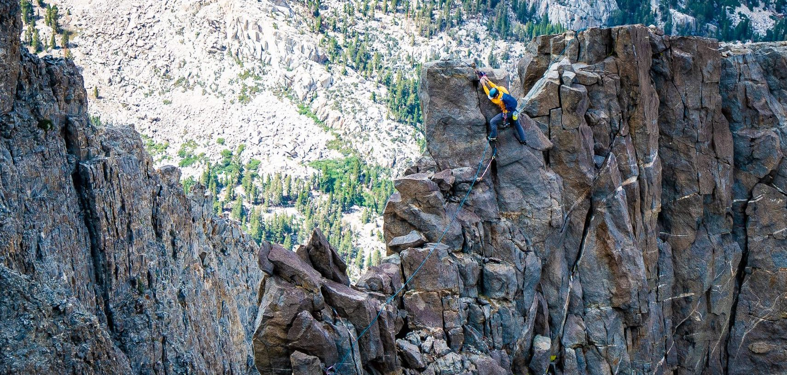

Hi! :) I'm Brett (he/him), a senior staff engineer at [Quip](https://quip.com/about), where I've been since autumn 2016. I'm an infrastructure generalist and my current area of focus is our real-time update syncing system, but I do my best to balance that with working to address any pain points our engineering community may face as we grow. My core values at work are acting on feedback, fostering an inclusive environment, and treating my coworkers with kindness.

I've lived in California since 2007 and spend most of my spare time in the Sierra Nevada, climbing and [shooting photos](https://www.flickr.com/photos/194244949@N04/albums/72157720061526978).

## Quip

### Technical contributions

* [_Quip EKM (Enterprise Key Management)_](https://quip.com/security) TL 2018—2021
    * introduced data serialization layer
    * introduced customer data definition + tracking
    * the system is fault-tolerant and supports hundreds of thousands of en/decryptions per second with minimal end-user latency increase
* Oncall Rotation TL 2021—2022
* Infrastructure Team
    * MySQL primary/replica query routing
    * assorted MySQL / Redis resiliency and load balancing work

### Cultural contributions

* led an effort to remove noninclusive terminology from our code
* co-led a multi-year community undertaking to distribute responsibility of maintaining production health
    * introduced stewardship labels to code (server paths, services, asynchronous jobs, etc.)
    * redesigned our oncall rotation
    * built production health dashboards for every area
    * led workshops on and wrote documentation for production monitoring
* helped introduce "Things I Did documents" to increase IC agency in the people review process, in response to community feedback

## Climbing

* alpine:
    * _Sentinel Rock, Steck-Salathé_ (14h c2c)
    * _Temple Crag, Sun Ribbon Arête_ (<13h c2c)
    * _Lone Pine Peak, North ridge_ (8h b2s, roped from Notch A)
    * _Tuolomne Alpine Triple Crown: North Peak, NW ridge -> Conness, N ridge -> Conness, W ridge_ (<14h c2c)
* gym: V9, 5.13b/c

## Other

* [`symbol-navigation-hydra`](https://github.com/bgwines/symbol-navigation-hydra), an Emacs package for code navigation
* lifting: 250lbs low-bar squat
* cycling: Old La Honda 32:15
* I like to spend evenings playing piano. I'm currently playing Schubert's fantasie in f and Bach partita 2. Some of my favorite pieces from the past are the Chopin e minor concerto (first movt.), Beethoven's "Les Adieux" sonata, and the Mozart d minor concerto.
* [Titling: Fun in the Library](https://titling.tumblr.com)

---

